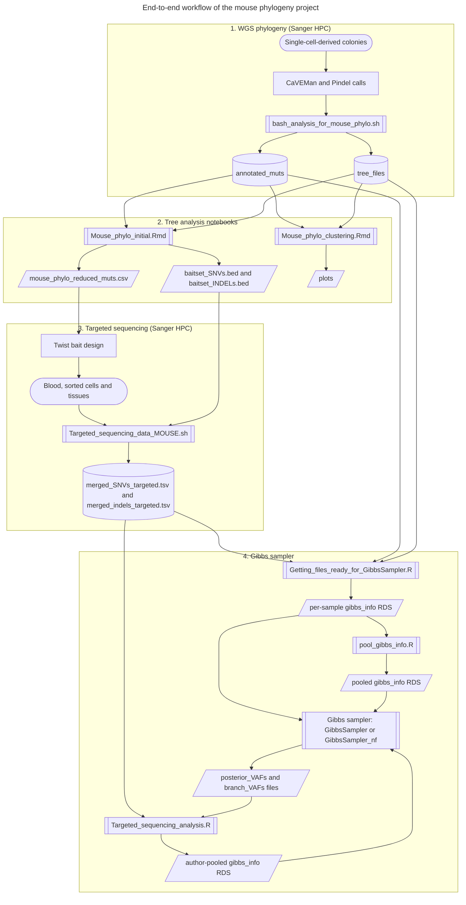
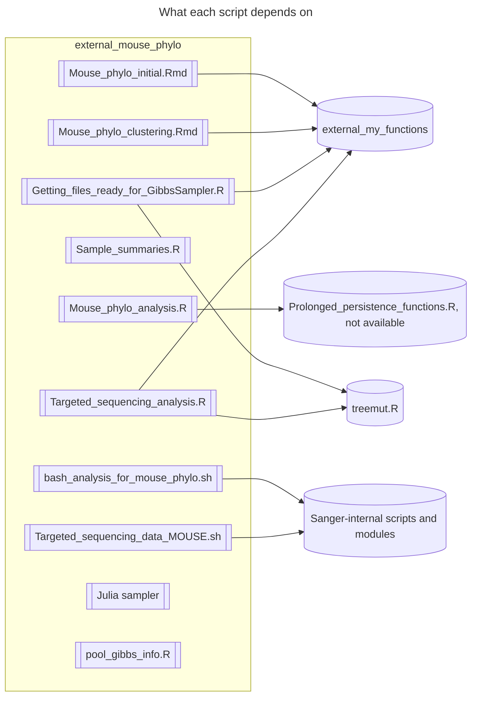
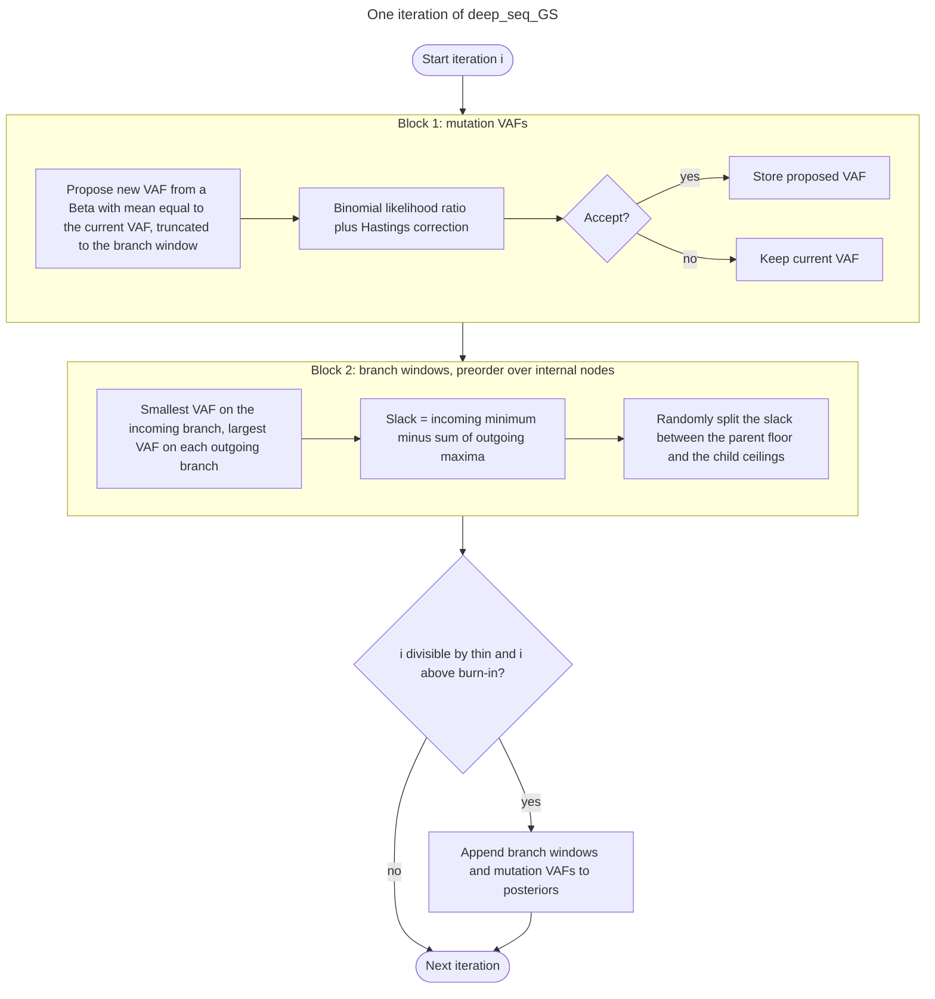
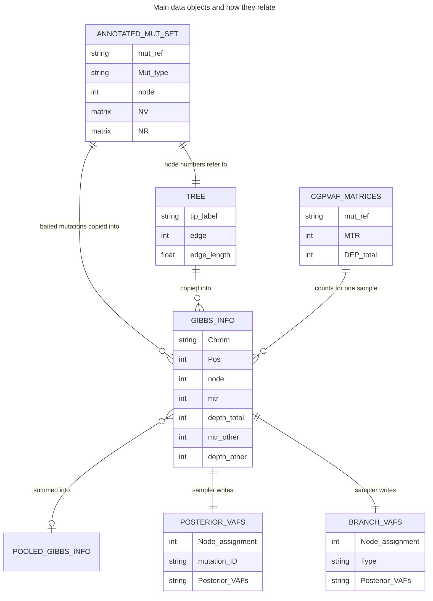
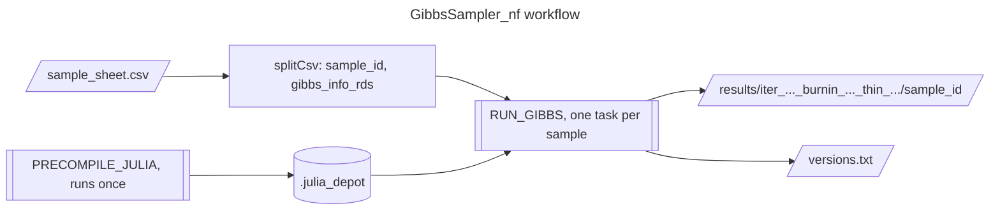
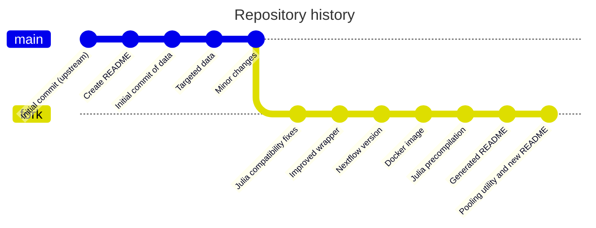

# external_mouse_phylo: mouse haematopoietic phylogeny analysis

This repository holds the code, intermediate data and outputs for a study that reconstructs the somatic phylogeny of haematopoiesis in two mice and then maps bulk tissues and sorted cell populations back onto those trees using targeted deep sequencing.

It is a fork of the upstream repository `mspencerchapman/mouse_phylo`. The fork adds a working, parameterised and containerised version of the Gibbs sampler (`targeted/GibbsSampler_nf/`), compatibility fixes to the original sampler (`targeted/GibbsSampler/`), and a sample-pooling utility (`mcare_scripts/pooling/`). Almost every R script depends on a companion library of R functions, [external_my_functions](https://github.com/medmaca/external_my_functions), which must be cloned alongside this repository.

> [!important] Read the known issues before reusing results
> Several defects were found while this document was being written, including one that probably biases the Gibbs sampler VAF estimates and three pooled sampler inputs that contain no reads at all. They are listed, with file and line references, in [Known issues and caveats](#Known%20issues%20and%20caveats). Where an issue concerns the intent of the original analysis it should be confirmed with the code's author before anything is changed.

## Contents at a glance

| Area | What it is | Main entry points |
| --- | --- | --- |
| Whole-genome sequencing (WGS) phylogeny | Somatic mutations called in single-cell-derived colonies, filtered, and used to build one tree per mouse | `bash_analysis/bash_analysis_for_mouse_phylo.sh`, `annotated_muts`, `tree_files` |
| Tree analysis notebooks | Tree plotting, anatomical clustering tests, clonality modelling, bait-set design | `Mouse_phylo_initial.Rmd`, `Mouse_phylo_clustering.Rmd` |
| Targeted sequencing | Deep sequencing of branch-defining mutations in blood, sorted cells and tissues | `targeted/Targeted_sequencing_data_MOUSE.sh`, `targeted/Getting_files_ready_for_GibbsSampler.R`, `targeted/Targeted_sequencing_analysis.R` |
| Gibbs sampler | Bayesian estimation of the VAF of every tree branch in each targeted sample | `targeted/GibbsSampler` (original), `targeted/GibbsSampler_nf` (Nextflow and container) |
| Pooling | Summing read counts across samples from the same mouse to raise depth | `mcare_scripts/pooling` |

## The study in brief

Two male mice were studied. Single haematopoietic stem and progenitor cells were sorted from bone marrow taken from four skeletal sites (femur, tibia, iliac crest and spine), expanded into colonies, and whole-genome sequenced. Somatic mutations shared between colonies define the branches of a phylogenetic tree; mutations unique to one colony sit on its private (terminal) branch.

A custom Twist Bioscience bait set was then designed to capture a selection of these branch-defining mutations. Many blood samples (four lineages at four ages), sorted immune populations and solid tissues from the same two mice were deep-sequenced with it. For each targeted sample the Gibbs sampler estimates how large a fraction of the sample descends from each branch of the tree.

### Identifier mapping

Each mouse carries three identifiers depending on the stage of the work. The targeted samples were given new internal IDs distinct from the WGS IDs, and the sample supplier used an animal number.

| Context | Mouse 1 | Mouse 2 |
| --- | --- | --- |
| WGS and phylogeny ID (`Phylo_MDIDs` in the code) | `MD7634` | `MD7635` |
| Targeted sequencing internal ID (`MDIDs`, prefix of `INTERNAL_CASM_SAMPLE_NAME`) | `MD7816` | `MD7817` |
| Supplier animal number (middle field of `SUPPLIER_SAMPLE_ID`, for example `GM_341_9w`) | `341` | `348` |

Sample naming follows from this:

- WGS colonies are `MD7634<letters>` and `MD7635<letters>`, for example `MD7634aa`. The tips of each tree are these colony IDs plus one extra tip called `Ancestral`, which represents the root.
- Individual targeted samples are `MD7816<letters>` and `MD7817<letters>`, for example `MD7816c`.
- Pooled targeted samples produced by the original author use the WGS ID plus a pool name, for example `MD7634_Bcells`. Pools produced by the pooling utility in this repository use the targeted ID, for example `MD7816_Bcell`.

### Key numbers

| Quantity | MD7634 | MD7635 | Source |
| --- | --- | --- | --- |
| Colonies in the final tree (excluding `Ancestral`) | 154 | 133 | `tree_files/*_post_mix_post_dup.tree` |
| Mutations in the final annotated set (SNV plus indel) | 14,863 (13,908 SNV) | 13,792 (12,874 SNV) | `annotated_muts/*_post_mix_post_dup` |
| Mutations with targeted read counts (per-sample Gibbs inputs) | 4,629 | 4,812 | `targeted/GibbsSampler/data/*_gibbs_info.RDS` |
| Targeted samples with Gibbs inputs | 52 | 61 | as above |

Across both mice 312 colonies were submitted for WGS (`sample_metadata/shipping_info_doc.xlsx`) and 142 targeted samples were submitted, of which 113 have Gibbs sampler inputs.

## Folder tree

Data folders are summarised rather than listed file by file.

```text
external_mouse_phylo/
├── README.md                          this document (GitHub version)
├── README_obsidian.md                 the same document for an Obsidian vault
├── .gitignore                         unrelated template, see known issues
├── Mouse_phylo_initial.Rmd            main WGS tree analysis notebook
├── Mouse_phylo_clustering.Rmd         anatomical clustering over molecular time
├── Mouse_phylo_analysis.R             early standalone signature and clonality script
├── Sample_summaries.R                 sample counts and sequencing coverage estimates
├── Mouse_phylo_MD7634.html            rendered notebook (older version), mouse 1
├── Mouse_phylo_MD7635.html            rendered notebook (older version), mouse 2
├── mouse_phylo_all_muts.csv           bait design candidate list: every mutation
├── mouse_phylo_reduced_muts.csv       bait design submission list: reduced set
├── selected_tips.csv                  15 colonies per mouse whose private mutations were all baited
├── baitset_SNVs.bed                   SNVs covered by the final bait set
├── baitset_INDELs.bed                 indels covered by the final bait set
├── annotated_muts/                    filtered mutation sets (R .RData objects, no extension)
├── tree_files/                        Newick trees, four versions per mouse
├── bash_analysis/
│   └── bash_analysis_for_mouse_phylo.sh   WGS pipeline command log (Sanger HPC)
├── baitset_design/                    Twist design report and probe/target BED files
│   └── Sanger_Mouse_phylo_REDUCED_v2_TE-99621817_mm10/
├── sample_metadata/                   WGS and targeted sample manifests (Excel)
├── canapps_info/                      Sanger pipeline QC report for the WGS project
├── plots/                             chi-squared clustering plots
├── mcare_scripts/
│   └── pooling/
│       ├── pool_gibbs_info.R          pool Gibbs inputs within a mouse
│       └── example_pooling_groups.csv example grouping (blood lineages)
└── targeted/
    ├── Targeted_sequencing_data_MOUSE.sh      targeted sequencing command log (Sanger HPC)
    ├── Getting_files_ready_for_GibbsSampler.R builds per-sample Gibbs inputs
    ├── Targeted_sequencing_analysis.R         pooled inputs, output reading, plots, statistics
    ├── samples.txt                            targeted sample list
    ├── baitset_SNVs.bed, baitset_INDELs.bed   copies of the root BED files
    ├── merged_SNVs_targeted.tsv               cgpVAF read counts, SNVs
    ├── merged_indels_targeted.tsv             cgpVAF read counts, indels
    ├── full_cgpvaf_matrices.RDS               cgpVAF counts as R matrices
    ├── full_matrices.RDS                      alleleCounter counts as R matrices
    ├── sum_of_frac.RDS                        cached "sum of fractions" statistic
    ├── allele_counter/                        123 alleleCounter output files
    ├── GibbsSampler/                          original Julia sampler
    │   ├── wrap_gibbs.jl                      driver (one sample per call)
    │   ├── src/Deep_seq_tree_GS.jl            sampler engine
    │   ├── Project.toml, Manifest.toml        Julia environment
    │   ├── README.txt                         original two-line usage note
    │   └── data/                              152 <sample>_gibbs_info.RDS inputs
    └── GibbsSampler_nf/                       Nextflow pipeline around the sampler
        ├── main.nf, nextflow.config, conf/base.config
        ├── modules/local/precompile_julia.nf, run_gibbs.nf
        ├── bin/run_gibbs.jl                   command-line driver
        ├── src/Deep_seq_tree_GS.jl            patched engine
        ├── env/install.jl                     Julia package installer (Docker build)
        ├── Docker/Dockerfile, Docker/build.log
        ├── assets/sample_sheet.csv
        ├── test/engine_baseline.jl, test/regression_check.sh
        └── README.md                          pipeline-specific documentation
```

## How the pieces fit together

### End-to-end workflow



### Code dependencies

Most R code in this repository is written as scripts that `source()` every file in [external_my_functions](https://github.com/medmaca/external_my_functions) and, in the `targeted/` scripts, the `treemut.R` file from the separate [treemut](https://github.com/NickWilliamsSanger/treemut) repository. The WGS pipeline additionally calls a set of Sanger-internal scripts that are not in either repository.



`Sample_summaries.R`, the Julia sampler and `pool_gibbs_info.R` are self-contained apart from ordinary packages.

The functions this project actually calls from `external_my_functions` are:

| Function | Defined in | Used by |
| --- | --- | --- |
| `plot_tree`, `get_node_children`, `get_all_node_children` | `plot_tree.R` | notebooks, targeted scripts |
| `add_annotation`, `get_edge_info`, `add_binary_proportion`, `plot_category_tip_point` | `plot_tree_examples.R` | notebooks, targeted scripts |
| `nodeHeights`, `nodeheight`, `getTips`, `get_mut_burden`, `amovapval.fn` | `phytools_scripts.R` | notebooks, targeted scripts |
| `make.ultrametric.tree` (needs `phangorn`) | `Pop_size_estimation_functions.R` | notebooks, targeted scripts |
| `em.algo`, `get_ancestral_nodes`, `squash_tree`, `node_lineage_loss`, `plotDonut`, `add_annotation_targeted`, `get_node_cell_frac` | `targeted_analysis_functions.R` | notebooks, targeted scripts |
| `import_cgpvaf_SNV_and_INDEL` | `foetal.filters.parallel.R` | targeted scripts |

## Setting up

### Software

| Component | Needed for | Notes |
| --- | --- | --- |
| R 4.x | all `.R` and `.Rmd` files | tested versions are not recorded; the code predates R 4.5 in places |
| CRAN packages | notebooks and scripts | `ggplot2`, `dplyr`, `tidyr`, `gridExtra`, `ggrepel`, `RColorBrewer`, `tibble`, `ape`, `dichromat`, `seqinr`, `stringr`, `readxl`, `readr`, `data.table`, `plotrix`, `phangorn`, `VGAM`, `MCMCglmm`, `spam`, `devtools`, `optparse` (pooling only) |
| Bioconductor packages | notebooks | `GenomicRanges`, `IRanges`, `MutationalPatterns`, `Rsamtools`; `MASS` is listed with them but is a CRAN recommended package |
| `external_my_functions` | almost everything in R | clone next to this repository |
| `treemut.R` | `targeted/*.R` | from the [treemut](https://github.com/NickWilliamsSanger/treemut) repository |
| GRCm38 (mm10) `genome.fa` with `.fai` index | mutational signature chunks only | path set in each notebook's setup chunk |
| Julia 1.11 with `Phylo`, `RCall`, `DataFrames`, `Distributions`, `CodecZlib`, `ArgParse` | Gibbs sampler | easiest via the container, see below |
| Nextflow and Apptainer (or Docker) | `GibbsSampler_nf` | container image `docker://mcare/deep-seq-gibbs:0.1.0` |

> [!warning] Sourcing the whole function library needs more packages than the scripts load
> The notebooks source every file in `external_my_functions`. Some of those files call `library(devtools)`, `library(MCMCglmm)`, `library(phangorn)`, `library(spam)` and `require(VGAM)` when they are sourced, so these packages must be installed even though no notebook lists them. See K13 in [Known issues and caveats](#Known%20issues%20and%20caveats).

### Suggested directory layout

The scripts expect the two repositories and `treemut` to live under one parent folder. On an HPC the same layout works under your home or project space.

```text
<work_root>/
├── external_mouse_phylo/     this repository
├── external_my_functions/    companion R function library
└── treemut/                  clone of the treemut repository (for treemut.R)
```

```bash
cd <work_root>
git clone git@github.com:medmaca/external_mouse_phylo.git
git clone git@github.com:medmaca/external_my_functions.git
git clone https://github.com/NickWilliamsSanger/treemut.git
```

### Paths to edit before running

Every R script hardcodes the original author's paths, usually switching on whether the machine is a Mac (`Darwin`). Edit these variables to match `<work_root>` before running.

| File | Variable (line) | Set it to |
| --- | --- | --- |
| `Mouse_phylo_initial.Rmd` | `my_working_dir` (line 10) | `<work_root>/external_mouse_phylo/` (trailing slash required) |
| | `gfile` (line 11) | path to GRCm38 `genome.fa` |
| | function folder (line 20) | `<work_root>/external_my_functions/` |
| | `sample_ID` (line 137) | `"MD7634"` or `"MD7635"`; the notebook analyses one mouse per run |
| `Mouse_phylo_clustering.Rmd` | `my_working_dir`, `gfile`, function folder (line 11, line 12, line 22) | as above |
| | `sample_ID` (line 151) | `"MD7634"` or `"MD7635"` |
| `Sample_summaries.R` | `root_dir` (line 18, line 51) | `<work_root>/external_mouse_phylo/` |
| `targeted/Getting_files_ready_for_GibbsSampler.R` | `my_working_directory`, `R_functions_dir`, `tree_mut_dir` (lines 17-20); `root_dir` (line 113) | repository root, function library, `treemut` folder, `targeted/` folder |
| | tree and mutation folders (lines 139-145) | on non-Mac systems these point at `filtering_runs/...`; use the repository's `tree_files/` and `annotated_muts/` instead |
| `targeted/Targeted_sequencing_analysis.R` | same variables (lines 10-12, line 550, lines 576-582) | as above |
| `targeted/GibbsSampler/wrap_gibbs.jl` | `git_dir` (line 12), `out_dir` (line 13) | the `targeted/GibbsSampler` folder, and an output folder |
| `targeted/GibbsSampler_nf/nextflow.config` | `hpc_account` (line 27) | your SLURM account |

Relative paths used inside the notebooks (for example `annotated_muts/...`) resolve against `my_working_dir`, which the setup chunk sets as the knitr root directory.

### Setting up on an HPC

The R analyses are light and can run on a login or interactive node. The Gibbs sampler is the only heavy step, and the recommended route is the Nextflow pipeline with the prebuilt container:

1. Load or install Nextflow and Apptainer (module names vary by cluster).
2. Clone the repositories into your home or project space as shown above.
3. Build a sample sheet listing the `*_gibbs_info.RDS` files you want to run (absolute paths are safest).
4. Edit `hpc_account` and, if needed, the `viking2` profile in `nextflow.config` for your scheduler, or add your own profile.
5. Run the pipeline from a scratch working directory. Nextflow writes its `work/` directory where it is launched, so launch it from scratch space rather than from inside the repository.

See [Running the Gibbs sampler](#Running%20the%20Gibbs%20sampler) for the commands.

## Top-level scripts and notebooks

Authorship below is taken from the git history, using GitHub account names.

### Mouse_phylo_initial.Rmd

**Author:** `mspencerchapman`.
**Purpose:** the main analysis notebook for the WGS trees. It analyses one mouse per run.

**Inputs:**

- `annotated_muts/annotated_mut_set_<ID>_postMS_reduced_a_j_vaf_post_mix_post_dup` (loaded with `load()`, creates `filtered_muts`).
- `tree_files/tree_<ID>_postMS_reduced_a_j_vaf_post_mix_post_dup.tree`.
- `sample_metadata/CAMPUOY000001_REUPLOAD_..._WithCGPIDs20231219.xlsx` for the bone of origin (`TISSUE_PHENOTYPE`) of each colony.
- `selected_tips.csv` (bait design chunk, when not reselecting).
- `baitset_design/.../merged_probe_file_shareable_..._low.bed` (bait coverage check).
- The GRCm38 genome FASTA (mutational signature chunks only).

**Outputs:** plots in the knitted HTML, plus `baitset_SNVs.bed` and `baitset_INDELs.bed` written to the working directory by the last chunk. The CSV writing steps are switched off (`rewrite=F`, and the reduced list is commented out).

**Chunks in order:**

| Chunk | What it does |
| --- | --- |
| `setup` | Sets paths, sources every file in the function library, installs and loads packages, and defines local helpers: `plot_96profile`, `plot_96profile_mutref` (96-channel substitution spectra via `Rsamtools::scanFa`), `vaf_density_plot_final` and `binom_mix` (a wrapper around `em.algo` that fits 1 to n binomial components and keeps the lowest BIC). |
| `load_data` | Loads one mouse's mutation set and tree, plots the tree with tips coloured by bone of origin, and prints the number of private and shared mutations. |
| `plot_source` | Builds an ultrametric tree (`make.ultrametric.tree`, scaled to the mean mutation burden) and colours each branch by bone if all descendants come from one bone, black otherwise. Defines a local `plot_sharing_multiple` that overrides the library version. |
| `AMOVA` | Permutation test (30,000 permutations, `amovapval.fn`) of whether colonies cluster by bone more than expected, on cophenetic distances of the ultrametric tree. |
| `mutational_signatures` | `eval=FALSE`. 96-channel spectra of private versus shared mutations. |
| `VAF_plots` | VAF density of private mutations for the first 16 colonies. |
| `VAF_plots_private` | Pools private-mutation read counts from all colonies and plots the density for sites with depth over 20. |
| `binom_mix_model` | Binomial mixture (1 to 4 components, `set.seed(15)`) on high-depth private mutations. The component nearest 0.5 and any above it are called clonal; lower components are subclonal. Extrapolates the clonal fraction to all private mutations. |
| `branch_level_clonality_analysis` | Repeats the mixture per colony, then classifies each private mutation as clonal (binomial p = 0.5) or subclonal (p = 0.33) by posterior probability, using the pooled clonal proportion as the prior. |
| `private_branch_correction` | Scales each private branch by its colony's clonal proportion (or a uniform factor) to estimate in vivo mutation burdens, and summarises burden by bone. **Fails as committed**, see K3. |
| `corrected_ultrametric_tree` | Ultrametric tree and AMOVA on the corrected tree. |
| `mutlist1` | Loads both mice and (only if `rewrite=T`) writes `mouse_phylo_all_muts.csv`. |
| `mutlist2` | `eval=FALSE`. Adds per-mutation pooled counts and flags shared mutations and mutations from the 15 selected colonies per mouse (`selected_tips.csv`); the code that wrote `mouse_phylo_reduced_muts.csv` is commented out. |
| `baitset_check` | Intersects mutations with the final probe BED, writes `baitset_SNVs.bed` and `baitset_INDELs.bed`, and plots each tree with branches split by the proportion of mutations covered, both full and cut at 15 mutations. |

**How to run:** set the paths and `sample_ID` (see [Paths to edit before running](#Paths%20to%20edit%20before%20running)), then knit in RStudio or run `rmarkdown::render("Mouse_phylo_initial.Rmd")`. Run once per mouse. Fix K3 first or the render stops at `private_branch_correction`.

### Mouse_phylo_clustering.Rmd

**Author:** `mspencerchapman`.
**Purpose:** tests at which point in molecular time colonies from the same bone start to cluster together.

**Inputs:** as for the initial notebook (one mouse per run, `sample_ID` at line 151).

**Outputs:** `plots/<ID>_chisq_by_moltime_plot.pdf` (3 by 2 inches).

**What it does:**

1. Repeats the setup, loading, tree plotting and ultrametric tree steps of the initial notebook, and also plots a tree cut at 90 mutations (`squash_tree`).
2. For every molecular-time cut-off from 1 to 60 mutations it finds the clades whose branch crosses the cut-off (`get_expanded_clade_nodes`), keeps clades with more than one colony, tabulates the bones of their colonies into a clade-by-bone matrix, and runs `chisq.test` against the overall bone proportions.
3. Plots the p-value against cut-off, with p < 0.05 highlighted.

**How to run:** as for the initial notebook. `get_expanded_clade_nodes` is not defined by the notebook or the function library (K11); copy its definition from `targeted/Getting_files_ready_for_GibbsSampler.R` (lines 79-89) into the setup chunk first.

### Mouse_phylo_analysis.R

**Author:** `mspencerchapman`.
**Purpose:** an early, standalone version of the signature and clonality analysis for MD7634, superseded by the initial notebook.

**Inputs:** the MD7634 mutation set and tree under a `filtering_runs/` folder, the GRCm38 genome, and `Prolonged_persistence_functions.R` from a Sanger path.

**Outputs:** `Private_muts_sig_MD7634.pdf`, `Shared_muts_sig_MD7634.pdf`, `Private_muts_VAF.pdf` and `Clonal_vs_nonclonal_muts_sig_MD7634.pdf` in the working directory.

**How to run:** not runnable as committed (K12). Treat it as a record; use the initial notebook instead.

### Sample_summaries.R

**Author:** `mspencerchapman`.
**Purpose:** descriptive summaries for sample planning.

**Inputs:** `sample_metadata/shipping_info_doc.xlsx`, `canapps_info/Cancer_Pipeline_Reports_3357.xls` (header skipped by 2 rows) and `sample_metadata/CASM_STS_Sample_MANIFEST_Lily_Cabrera_York_July_2024_x2_plates.xlsx` (header in row 1, data from row 14).

**Outputs:** printed tables and plots only.

**What it does:**

1. WGS: joins the shipping sheet to the pipeline report by sample name, keeps colonies with sequencing coverage (`Seq X`) above 4, and counts colonies per mouse and per bone, with a bar chart.
2. Targeted: plots the distribution of DNA input (volume times concentration), estimates the number of sequencing reactions if every 5 ng aliquot were a separate library plus 30 resequenced colonies, and estimates coverage per sample for 100 bp paired-end reads on one lane of a NovaSeq 10B flow cell (1.25 billion reads per lane), a 2.85 Mb target and 30 % on-target rate.

**How to run:** set `root_dir`, then source it interactively. It calls `View(dat)`, which needs an interactive session.

### Top-level data files

| File | Format | Contents | Produced by |
| --- | --- | --- | --- |
| `mouse_phylo_all_muts.csv` | CSV: `Chrom,Start,Stop,tiling` (0-based start, `1X` tiling) | every mutation from both mice, 28,655 rows | `Mouse_phylo_initial.Rmd`, `mutlist1` |
| `mouse_phylo_reduced_muts.csv` | same | reduced set submitted for bait design, 11,452 rows (the design report records 11,450 regions): all shared mutations, private mutations with VAF over 0.45 and depth over 15, and all private mutations of the selected colonies | `mutlist2` (writing code now commented out) |
| `selected_tips.csv` | CSV: `sample_ID,node,colony_ID` | the 15 colonies per mouse whose private mutations were all included in the bait design | `mutlist2` with `reselect_tips=T` |
| `baitset_SNVs.bed`, `baitset_INDELs.bed` | tab-separated, no header: `Chrom Pos Ref Alt` (1-based) | mutations covered by the final probes: 8,414 SNVs and 1,027 indels | `baitset_check` |
| `Mouse_phylo_MD7634.html`, `Mouse_phylo_MD7635.html` | HTML | knitted output of an older version of `Mouse_phylo_initial.Rmd` (no clonality sections) | knitting |

## Folder reference

### annotated_muts

**Author:** `mspencerchapman`. Six R data files (saved with `save()`, no file extension), three processing stages per mouse. Load one with `load(path)`, which creates an object called `filtered_muts`.

| Stage suffix | Meaning (inferred from names and contents) | MD7634 | MD7635 |
| --- | --- | --- | --- |
| `_postMS_reduced_a_j_vaf` | after the MS (hairpin) artefact filters and VAF-based filtering; tree built with an ancestral branch (`a`) from SNVs only (`j`) | 154 colonies, 14,863 mutations | 136 colonies, 14,038 mutations |
| `_post_mix` | after removing colonies judged to be mixed (not clonal) | unchanged | 133 colonies, 13,792 mutations |
| `_post_mix_post_dup` | after removing duplicate colonies; this is the version every script uses | unchanged | unchanged |

The steps that produced `_post_mix` and `_post_dup` are not in this repository; confirm their details with the code's author.

Structure of `filtered_muts`:

| Element | Contents |
| --- | --- |
| `COMB_mats.tree.build$mat` | data frame, one row per mutation: `Chrom`, `Pos`, `Ref`, `Alt`, `mut_ref` (`Chrom-Pos-Ref-Alt`), `Mut_type` (`SNV` or `INDEL`), `node` (the ape node number of the branch the mutation was assigned to), `pval` (fit to the assigned branch), VAGrENT annotation (`Gene`, `Transcript`, `RNA`, `CDS`, `Protein`, `Type`, `SO_codes`), `coding_change`, `coding_change_chip`, `ChromPos`, `variant_ID` |
| `COMB_mats.tree.build$NV`, `$NR` | variant read counts and total depth, mutations by colonies |
| `COMB_mats.tree.build$PVal` | per-colony p-value for a true somatic (heterozygous) mutation |
| `COMB_mats.tree.build$Genotype_bin` | genotype matrix used for tree building (1 present, 0 absent, 0.5 uncertain) |
| `COMB_mats.tree.build$gender`, `$nsamp` | sex and colony count |
| `Genotype_shared_bin`, `dna_strings` | shared-mutation genotypes and the dummy sequences used by the tree builder |
| `filter_code`, `params`, `summary` | which filters each mutation passed, the filter settings and summary counts |

A mutation's `node` is interpreted against the matching tree file: nodes 1 to N are tips (private mutations of that colony), N + 1 is the root, and higher numbers are internal nodes. This is the standard `ape` numbering.

### tree_files

**Author:** `mspencerchapman`. Newick trees, read with `ape::read.tree()`. Branch lengths are numbers of mutations; internal node labels are bootstrap-style support values. Each tree includes the `Ancestral` tip with a zero-length branch from the root.

| File suffix | Notes |
| --- | --- |
| `_postMS_reduced_a_j_vaf_v1.tree` | an earlier build of the stage-one tree |
| `_postMS_reduced_a_j_vaf.tree`, `_post_mix.tree`, `_post_mix_post_dup.tree` | trees matching the three `annotated_muts` stages |

### bash_analysis

#### bash_analysis_for_mouse_phylo.sh

**Author:** `mspencerchapman`.
**Purpose:** a record of the commands run on the Sanger LSF cluster to go from pipeline mutation calls to filtered mutation sets and trees. It is a command log to be run section by section, not a script to run end to end, and depends on Sanger modules and internal scripts that are not available elsewhere (K14).

```mermaid
---
title: WGS processing recorded in bash_analysis_for_mouse_phylo.sh
---
flowchart LR
    accTitle: WGS processing steps
    accDescr: Pipeline calls are filtered for low-input artefacts, re-genotyped across all colonies with cgpVAF, merged into matrices, filtered, assessed for sensitivity, and used to build trees.

    vcfs[/CaVEMan and Pindel VCFs/] --> ms[MS hairpin filters per colony]
    vcfs --> bed[Unique variant sites as BED]
    bed --> cgpvaf[cgpVAF across all colonies]
    cgpvaf --> merge[Merge per-batch outputs into matrices]
    merge --> params[[Mutation_filtering_get_parameters_MOUSE.R]]
    ms --> msbed[MS-passed sites BED]
    params --> reduce[[Reducing_mutset_from_MSfilters.R]]
    msbed --> reduce
    reduce --> sens[[Sensitivity_analysis_from_SNPs.R]]
    reduce --> tree[[tree-building script, not recorded]]
    sens --> tree
    tree --> outputs[(annotated_muts and tree_files)]
```



**Steps:**

| Section | What it does |
| --- | --- |
| Variables | Study `mouse_phylo`, experiment `MD7634` (edit for `MD7635`), WGS project 3357, in silico matched normal `MDGRCm38is` (project 1670), donor age 2, GRCm38 reference and high-depth region mask. |
| LCM filtering jobs | Submits the "Mathijs" filters (`Submitting_Mathijs_filters_jobs.R`). From the script names these are understood to be the low-input (laser-capture microdissection) artefact filters, including the hairpin (cruciform DNA) filter, described in the low-input protocol of Ellis et al. (2021) and packaged by Sanger as `hairpin-wrapper`; confirm with the code's author. |
| SNV analysis | Imports the CaVEMan pass calls (`import_new_samples_only.R`), reduces them to a BED of unique sites, then runs cgpVAF (`createVafCmd.pl`, option 3 for CaVEMan input, with `-mq 30 -bo 1`) on every colony. A split config (`create_split_config_ini.R`) batches the samples; the generated `run_bsub.sh` is edited to allow more parallel jobs and memory. |
| Indel analysis | The same with Pindel calls (option 1). |
| SNV and indel merge | Cuts the `MTR` and `DEP` columns from each batch file (the fixed column numbers assume at most 11 samples per file) and `paste`s them into `merged_SNVs_<ID>.tsv` and `merged_indels_<ID>.tsv`. |
| Filtering parameters | `Mutation_filtering_get_parameters_MOUSE.R`, run twice: all colonies, and (`-m -v 0.4`) excluding colonies with a peak VAF below 0.4 (the `_m40` run). |
| MS reduction | Builds a BED of MS-passed sites and runs `Reducing_mutset_from_MSfilters.R` for both runs. |
| Sensitivity | `Sensitivity_analysis_from_SNPs.R` estimates per-colony SNV and indel detection sensitivity from germline SNPs. |
| Tree building | Two calls to the tree-building script, p-value based (`-f pval`) and VAF based (`-f vaf`), keeping an ancestral branch (`-a`), SNVs only for the initial topology (`-j`), polytomous output (`-p`). `TREE_BUILDING_SCRIPT` is blank in the file. |
| Final loop | An alternative per-sample submission of the 2024 LCM filter (`runlcmfilter.sh`) against the colony BAMs. |

### baitset_design

**Author:** `mspencerchapman` (files produced by Twist Bioscience). Design `Sanger_Mouse_phylo_REDUCED_v2_TE-99621817_mm10`, dated 27 August 2024, mm10 coordinates with `chr` prefixes, low-stringency repeat filtering.

| File | Contents |
| --- | --- |
| `DesignReport_...pdf` | Twist's design report |
| `.../merged_probe_file_shareable_..._low.bed` | probe intervals; column 4 lists the targets each probe covers (`chr1_3298786_3298787`). This is the file the notebook and the targeted shell script use |
| `.../all_target_segments_..._low.bed` | all submitted target segments |
| `.../all_target_segments_covered_by_probes_..._low.bed` | targets with at least one probe |
| `.../all_target_segments_not_covered_by_probes_..._low.bed`, `..._with_zero_probes_..._low.bed` | targets that could not be covered |
| `.../UCSC_Custom_Tracks_..._low.bed` | browser tracks |
| `.../report_..._low.html` | HTML design summary |

### sample_metadata

**Author:** `mspencerchapman`. Sanger sample manifests (Excel).

| File | Contents | Used by |
| --- | --- | --- |
| `CAMPUOY000001_REUPLOAD_..._WithCGPIDs20231219.xlsx` | WGS colony manifest (312 rows, sheet `Metadata Entry`); `INTERNAL_CASM_SAMPLE_NAME` is the colony ID and `TISSUE_PHENOTYPE` the bone (`Femur`, `Tibia`, `Iliac`, `Spine`) | both notebooks |
| `shipping_info_doc.xlsx` | the same 312 colonies, as shipped | `Sample_summaries.R` |
| `CASM_STS_Sample_MANIFEST_Lily_Cabrera_York_July_2024_x2_plates.xlsx` | targeted-sequencing submission manifest, with template rows above the data | `Sample_summaries.R` |
| `targeted_metadata.xlsx` | tidy targeted metadata, 142 samples: `SUPPLIER_SAMPLE_ID` (marker or tissue, animal and age, for example `CD11b+_341_9w` or `B1a_PC_341`), `TISSUE_PHENOTYPE` and `INTERNAL_CASM_SAMPLE_NAME` | targeted scripts; the pooling example was derived from it |
| `~$CAMPUOY000001_...xlsx` | an Excel lock file committed by accident | none |

The scripts derive three fields from `SUPPLIER_SAMPLE_ID` by splitting on `_`: `flow_marker` (field 1), `age` (field 3, only meaningful for blood) and, from the internal name, `PDID` (first six characters, the targeted mouse ID).

> [!caution] Personal data
> Three of the manifests contain populated collaborator name, email address and postal address columns. Keep the repositories private and do not copy these files into anything public.

### canapps_info

**Author:** `mspencerchapman`. `Cancer_Pipeline_Reports_3357.xls` is the Sanger pipeline status and QC report for WGS project 3357 (per-sample sequencing coverage `Seq X`, and CaVEMan, Pindel, ASCAT and other pipeline statuses). The first two rows are headers to skip. Used by `Sample_summaries.R`.

### plots

**Author:** `mspencerchapman`. `MD7634_chisq_by_moltime_plot.pdf` and `MD7635_chisq_by_moltime_plot.pdf`, written by `Mouse_phylo_clustering.Rmd`.

### mcare_scripts/pooling

**Author:** `medmaca`.
**Purpose:** pool per-sample Gibbs sampler inputs within one mouse by summing read counts, to raise the depth on every mutation before running the sampler. This mainly helps the low-VAF, deep branches, where single samples are too shallow to separate signal from sequencing error.

#### pool_gibbs_info.R

**Inputs:**

- `--grouping`: a CSV with at least the columns `sample_id` and `pool_id`. Other columns are ignored. Rows with an empty `pool_id` are skipped. A sample may appear in more than one pool.
- `--indir`: the folder holding the per-sample `<sample_id>_gibbs_info.RDS` files, normally `targeted/GibbsSampler/data`.
- `--outdir`: where to write pooled files (default `.`, created if missing).
- `--suffix`: input and output filename suffix (default `_gibbs_info.RDS`).

**Output:** one `<pool_id>_gibbs_info.RDS` per pool, with the same structure as any other Gibbs input, so it can go straight into the sampler sample sheet.

**What it does:**

1. Checks that every input file exists before writing anything (added on 18 September 2026 so that a missing file cannot leave a half-written set of pools).
2. For each pool, reads the member files and checks that every member has the same tree (tip labels, edge matrix and edge lengths), the same set of mutations, the same node assignment and identical control columns. Any mismatch stops the run with a message naming the pool and member. This is what refuses a pool that mixes the two mice.
3. Sums `mtr` and `depth` across members, mutation by mutation, matching by `Chrom-Pos-Ref-Alt` so row order does not matter.
4. Keeps a single copy of `mtr_other` and `depth_other`. These are the other mouse's read counts, identical for every sample of one mouse; summing them would inflate the control depth and understate the error rate.
5. Keeps the tree unchanged and writes the pooled file, printing median per-sample and pooled depths.

Errors exit with status 1 and a message, so the script can be used in pipelines. The functions can also be sourced from R (`source("pool_gibbs_info.R")`) for testing; the command-line entry point only runs under `Rscript`.

**How to run:**

```bash
cd <work_root>/external_mouse_phylo
Rscript mcare_scripts/pooling/pool_gibbs_info.R \
    --grouping mcare_scripts/pooling/example_pooling_groups.csv \
    --indir targeted/GibbsSampler/data \
    --outdir <scratch>/pooled_gibbs_inputs
```

Then add the pooled files to a Gibbs sampler sample sheet exactly as for single samples.

**Using it correctly:**

- Pool only samples from the same mouse. The script enforces this, but choose pools that make biological sense: samples in which the clones of interest are expected to co-occur. Pooling across very different compartments adds depth but blurs the differences you may want to compare.
- Pooling a lineage across ages gives a time-averaged profile and loses the time course. To keep the ages apart, pool within an age instead.
- Pooled files contain SNVs and indels. The author's own pooled inputs (`MD7634_*`, `MD7635_*` in `targeted/GibbsSampler/data`) are SNV only (K6), so do not mix the two kinds of input in one comparison without accounting for this.
- A sample needs a per-sample input file to be pooled. `MD7817q` has none (K7), so it has no `pool_id` in the example.

#### example_pooling_groups.csv

**Author:** `medmaca`. 114 rows, one per targeted sample, derived from `sample_metadata/targeted_metadata.xlsx`. Columns: `sample_id`, `mouse` (targeted ID), `marker` (first field of `SUPPLIER_SAMPLE_ID`), `age` (blood samples only), `supplier_id`, and `pool_id`. Only the longitudinal blood samples are assigned, giving six pools; the terminal-harvest samples are left blank for you to assign.

| Pool | Markers | Members |
| --- | --- | --- |
| `MD7816_Myeloid` | `GM`, `CD11b+` | 6 |
| `MD7816_Bcell` | `B220+` | 4 |
| `MD7816_Tcell` | `CD3e+` | 4 |
| `MD7817_Myeloid` | `GM`, `CD11b+` | 7 |
| `MD7817_Bcell` | `B220+` | 3 |
| `MD7817_Tcell` | `CD3e+` | 3 (`MD7817q` unassigned because it has no input file) |

#### Verification performed

The script and example were tested on 18 September 2026 against the data in this repository:

| Test | Result |
| --- | --- |
| Full run of the example grouping | 6 pools written, exit status 0 |
| Pooled `mtr` and `depth` equal the sum of the members, row by row | identical in all 6 pools |
| Control columns and tree carried through unchanged | identical in all 6 pools |
| Comparison with the author's pooled inputs on the SNV rows (`MD7816_Bcell` against `MD7634_Bcells`, `MD7816_Tcell` against `MD7634_Tcells`, `MD7816_Myeloid` against `MD7634_GranMono`, and the same for MD7817 and MD7635) | `mtr` and `depth` identical for every SNV in all 6 pairs |
| Pool containing one sample from each mouse | refused, "different tree", nothing written |
| Grouping referencing a missing input | refused before writing, output folder not created |
| Empty grouping, wrong column names, missing arguments | clear error messages, exit status 1 |
| Pooled file run through the sampler container (`run_gibbs.jl`, 300 iterations) | ran and wrote both output files |

The original example assigned `MD7817q` to `MD7817_Tcell`, which made the run fail after five pools had been written; that row's `pool_id` has been blanked and the existence check added.

## targeted folder reference

### Data files

| File | Format and contents | Produced by |
| --- | --- | --- |
| `merged_SNVs_targeted.tsv` | tab-separated with header: `Chrom`, `Pos`, `Ref`, `Alt`, then `<sample>_MTR` (variant reads) and `<sample>_DEP` (total depth) for the in silico normal `MDGRCm38is` and 114 targeted samples; 8,412 SNVs | `Targeted_sequencing_data_MOUSE.sh` (cgpVAF) |
| `merged_indels_targeted.tsv` | the same for 1,026 indels; `MD7817q` is missing from this file | as above |
| `full_cgpvaf_matrices.RDS` | list `mat` (mutation table with `Mut_type`), `NV`, `NR`: 9,438 mutations by 114 columns (113 samples present in both TSVs plus `MDGRCm38is`) | `import_cgpvaf_SNV_and_INDEL` in both targeted R scripts (regenerated on every run) |
| `full_matrices.RDS` | list `NV`, `NR` from alleleCounter: 8,420 SNVs by 123 samples | `import_allele_counter_data` (only if absent) |
| `sum_of_frac.RDS` | cached "sum of fractions" posteriors: for each mouse, each targeted sample and each molecular-time cut-off (2 to 50 in steps of 2), 100 posterior values | `Targeted_sequencing_analysis.R` |
| `samples.txt` | 123 targeted sample IDs (output of the metrics step, see K23) | `Targeted_sequencing_data_MOUSE.sh` |
| `baitset_SNVs.bed`, `baitset_INDELs.bed` | identical copies of the root files | copied by hand |
| `allele_counter/<sample>.allelecounts.txt` | alleleCounter output per sample: `#CHR POS Count_A Count_C Count_G Count_T Good_depth` at the baited SNV positions | `Targeted_sequencing_data_MOUSE.sh` |

In both count matrices "depth" (`DEP`, `NR`, `Good_depth`) is the **total** number of reads at the site, not the number of reference reads. This matters for the Gibbs sampler (K1).

### Targeted_sequencing_data_MOUSE.sh

**Author:** `mspencerchapman`.
**Purpose:** command log of the targeted sequencing processing on the Sanger LSF cluster (targeted project 3523, GRCm38). Like the WGS log it is run section by section and relies on Sanger modules and scripts (`FluidigmAlleleCounter.sh`, `hs_metrics_loop.sh`, `stageBam.pl`, `create_split_config_ini.R`) that are not in this repository.

**Steps:**

1. alleleCounter at every baited SNV for every sample (LSF job), giving `allele_counter/`.
2. Converts the Twist probe BED into Picard interval lists (probes, and targets parsed from the probe names) and stages the BAMs.
3. Picard hybrid-selection metrics per sample, combined into `metrics_table.txt`. This step overwrites `samples.txt` with names cut from the metrics files.
4. cgpVAF for SNVs (option 3) and indels (option 1) against the in silico normal, split into batches of 10 samples, then merged by cutting the `MTR` and `DEP` columns into `merged_SNVs_targeted.tsv` and `merged_indels_targeted.tsv`.
5. The last lines record how the Gibbs sampler was run on the cluster (`julia/1.9.2`) and locally. The final two lines are R code, not shell.

### Getting_files_ready_for_GibbsSampler.R

**Author:** `mspencerchapman`.
**Purpose:** builds one Gibbs sampler input per targeted sample.

**Inputs:** the final `annotated_muts` and `tree_files` for both mice, `baitset_SNVs.bed`, `allele_counter/`, `merged_SNVs_targeted.tsv`, `merged_indels_targeted.tsv` and `sample_metadata/targeted_metadata.xlsx`. It sources the function library (skipping the second file listed, which is `foetal.filters.R`) and `treemut.R`.

**Outputs:** `targeted/output/<sample>_gibbs_info.RDS` for every targeted sample present in both cgpVAF files (113 files; the copies in `targeted/GibbsSampler/data/` were presumably moved there by hand), `full_matrices.RDS` if absent, and `full_cgpvaf_matrices.RDS` (always rewritten).

**Functions defined:**

| Function | Arguments | Returns |
| --- | --- | --- |
| `import_allele_counter_data` | `allele_counter_dir`, `suffix`, `bed_file` (Chrom, Pos, Ref, Alt), `verbose` | list `NV`, `NR`; NV is the count of the `Alt` base, NR is `Good_depth` |
| `calculate_cell_frac` | `NV`, `NR`, `sex` | cell fraction: NV/(NR/2) for autosomes, NV/NR for X and Y in males, capped at 1 |
| `get_expanded_clade_nodes` | `tree`, `height_cut_off`, `min_clonal_fraction`, `min_samples` | data frame of branches crossing the cut-off: `nodes`, `n_samples`, `MRCA_time`, `clonal_fraction` |
| `aggregate_cols_by_tissue` | `NV`, `NR` | NV and NR summed by the prefix before `_` in the column names (not used) |

**Steps:**

1. Loads both mice's mutation tables and trees.
2. Imports alleleCounter and cgpVAF counts.
3. For each mouse keeps the mutations present in the cgpVAF matrices and the samples of that mouse that passed sequencing.
4. For each mouse computes the control columns: `mtr_other` and `depth_other` are the variant reads and total depth at each of this mouse's mutations, summed over every targeted sample of the **other** mouse. Because the two mice share essentially no somatic mutations, these reads measure sequencing and mapping noise at each site.
5. For each sample writes `list(details = ..., tree = ...)` where `details` has `Chrom`, `Pos`, `Ref`, `Alt`, `node`, `mtr`, `depth`, `mtr_other`, `depth_other`.

**How to run:** set the paths (see [Paths to edit before running](#Paths%20to%20edit%20before%20running)), create `targeted/output/`, and source the script from R with the working directory at the repository root (the metadata path is relative).

### Targeted_sequencing_analysis.R

**Author:** `mspencerchapman`.
**Purpose:** a working notebook in script form covering the pooled Gibbs inputs, reading sampler output, plotting posterior cell fractions on trees, the "sum of fractions" statistic, a soft cosine similarity between samples, and a non-phylogenetic Bayesian presence classifier. It is meant to be run section by section, not sourced top to bottom (K10).

**Sections:**

| Lines | Section | What it does |
| --- | --- | --- |
| 1-548 | Setup and functions | sources libraries and defines the functions below |
| 550-653 | Data import | as in `Getting_files_ready_for_GibbsSampler.R` |
| 659-673 | Coverage | median coverage histogram per mouse, blood against other samples |
| 679-738 | Pooled inputs | for one mouse (`ID=Phylo_MDIDs[2]`, edit for the other) sums counts across samples by pattern-matching `SUPPLIER_SAMPLE_ID` and writes `GibbsSampler/data/<WGS ID>_<pool>_gibbs_info.RDS`, SNVs only |
| 741-756 | Run the sampler | calls `julia wrap_gibbs.jl <pool>` for every pool without output |
| 761-812 | Compare two samples | reads two posteriors, plots each on the tree and plots their per-mutation ratio |
| 815-829 | Read all posteriors | reads every `*_posterior_VAFs.txt.gz` for both mice into `posterior_cell_fracs` |
| 849-895 | Plot one sample | scratch code for a single sample (K10) |
| 901-964 | Sum of fractions | see below; writes `plots/Sum_of_frac_through_time.pdf` |
| 967-1155 | Soft cosine similarity | not adapted to this project (K4) |
| 1161-1248 | Bayesian classifier | beta-binomial presence probabilities per mutation and sample, then tree plots to `plots/Bayesian_classifier_plots_<ID>.pdf` (fails, K9) |

**Pool definitions used for the author's pooled inputs** (patterns are regular expressions matched against `SUPPLIER_SAMPLE_ID`):

| Group | Pool | Pattern |
| --- | --- | --- |
| across time | `GranMono` | `CD11b\+_\d` or `GM` |
| | `Bcells` | `B220` |
| | `Tcells` | `CD3e` |
| | `BandT` | `B220` or `CD3e` |
| by time point | `nine_week_blood`, `fifteen_week_blood`, `twentyone_week_blood`, `twentyseven_week_blood` | `_9w`, `_15w`, `_21w`, `_27w` |
| by tissue | `LymphNode`, `Spleen`, `Lung`, `Thymus`, `Skin`, `Peritoneal`, `Liver` | `_LN_`, `_Sp_`, `_Lu_`, `_Thy_`, `Sk_`, `_PC_`, `_Li_` |
| by cell type | `iNKT`, `ILC2`, `ILC3`, `allILC` | `iNKT_`, `ILC2_`, `ILC3_`, `ILC` |

Three of the resulting 38 files match no samples and contain only zero counts (K2).

**Functions defined:**

| Function | Arguments | Returns or does |
| --- | --- | --- |
| `bbprob.calculator` | variant reads, depth, error and mutation beta-binomial parameters, prior | posterior probability that a mutation is present in a sample |
| `moment.est` | reads, depth, weights | weighted method-of-moments mean and overdispersion (Kleinman 1973), used to fit the error distribution |
| `generate_targ_seq_plots` | samples, tree, mutations, matrices, `post.prob`, display options | tree coloured by presence probability or cell fraction, with node cell-fraction labels and donut charts; redefines the library version |
| `import_allele_counter_data`, `calculate_cell_frac`, `get_expanded_clade_nodes` | as in the preparation script | |
| `aggregate_cols` | NV, NR, metadata, mouse ID, named list of patterns | summed NV and NR per pool plus the members of each pool |
| `read_posterior_VAFs_return_cell_frac` | path to `<sample>_posterior_VAFs.txt.gz` | data frame of `Node_assignment`, `mutation_ID` and 100 posterior cell fractions (2 x VAF) |
| `get_95percentCI_cellfrac`, `get_median_cellfracs` | posterior data frame | quantiles or medians per mutation |
| `get_cutoff_branches` | tree, cut-off | branches crossing a molecular-time cut-off |
| `get_sum_of_frac` | posterior, tree, cut-off | 100 posterior draws of the summed cell fraction of all clones present at the cut-off |
| `Gibbs_targ_seq_plots` | sample, tree, mutations, posterior | tree with each mutation coloured by its log median cell fraction |
| `Gibbs_targ_seq_comparison_plots` | two posteriors, mutations | tree coloured by log fold change between two samples, grey where the 95 % interval spans 1; uses a global `tree` |
| `add_var_col` | tree, mutations, node, field | redefinition that drops the `matrices` argument (K9) |
| `generate_median_fracs_across_tissues`, `shortest_dist`, `sum_tissue_scores`, `get_soft_cosim` | | soft cosine similarity helpers |

**The sum of fractions statistic.** For a molecular-time cut-off, every branch crossing the cut-off is a clone that existed at that time. For each crossing branch the code picks the mutation whose rank along the branch matches how far along the branch the cut-off falls, takes that mutation's posterior cell fraction, and sums across branches, draw by draw. The result estimates how much of a sample is accounted for by the sampled lineages at each molecular time; values well below 1 at a given time indicate lineages that the colonies did not capture.

**The soft cosine similarity.** Samples are compared by the median cell fractions of early ("embryonic", below 30 mutations of molecular time) mutations, with mutation pairs weighted by phylogenetic similarity (1/(distance + 1)). This is the comparison the project ultimately aims to make between lineages, but the code has not been adapted from the transplant study it came from.

## The Gibbs sampler

### What it estimates

For one targeted sample, each branch of the tree corresponds to a clone, and every mutation on that branch should be present in that clone's cells. The sampler estimates the VAF of every mutation in the sample and a window (top and bottom VAF) for every branch, subject to two facts:

1. **Read counts are noisy.** The variant read count of a mutation with true VAF `v` is modelled as `Binomial(n, p)` with `p = v(1 - e) + (1 - v)e`, where `e` is a per-site error rate.
2. **Clones are nested.** A descendant clone is a subset of its parent, so a parent branch's bottom VAF must be at least the sum of its children's top VAFs. The branches leaving the root start at 0.5, the VAF of a heterozygous mutation present in every cell.

Cell fraction is 2 x VAF for autosomal mutations and equals the VAF for X and Y mutations in these male mice.

The per-site error rate comes from the control columns. If `mtr_other + depth_other` is below 20 a flat rate of 0.01 is used; otherwise `e = (mtr_other + 0.5) / (mtr_other + depth_other + 1)`.

### One iteration



There is no explicit prior on the VAFs beyond the uniform-within-window assumption and the nesting constraint. On private branches, where the true VAF is at or below the error floor and there may be only one or two mutations, the constraint rather than the data drives the estimate. Pooling samples is the most direct way to add information there.

### Parameters

| Parameter | Default | Effect |
| --- | --- | --- |
| `iter` | 20000 | total iterations |
| `burn_in` | 10000 | iterations discarded before recording |
| `thin` | 100 | record every `thin` iterations; the defaults keep 100 draws |
| `scale_pm` | 50 (engine default 100) | concentration of the Beta proposal; larger means smaller steps |
| `min_VAF` | 1e-10 | floor on VAFs and the epsilon used in the constraints |
| seed | 42 in this fork (28 upstream) | random number seed |
| control coverage threshold | 20 | below this the flat error rate is used |
| flat error | 0.01 | fallback error rate |

### Input and output files

Input, one per sample (`<sample>_gibbs_info.RDS`): an R list with `tree` (ape `phylo`) and `details` (columns `Chrom`, `Pos`, `Ref`, `Alt`, `node`, `mtr`, `depth`, `mtr_other`, `depth_other`). The driver adds `mut_ref` (`Chrom-Pos-Ref-Alt`) and maps `node` to tree branches using ape numbering (tips 1 to N, root N + 1 skipped, internal nodes named `Node <n>` by the Julia `Phylo` conversion).

Outputs, gzipped and tab-separated:

| File | Columns | Notes |
| --- | --- | --- |
| `<sample>_posterior_VAFs.txt.gz` | `Node_assignment`, `mutation_ID`, `Posterior_VAFs` (comma-separated draws) | one row per mutation |
| `<sample>_branch_VAFs.txt.gz` | `Node_assignment`, `Type` (`Top_VAF` or `Bottom_VAF`), `Posterior_VAFs` | two rows per branch; each list starts with the initialisation value (0.5 or 0.0), so it holds one more value than the mutation lists. Drop the first value when parsing |

Read them in R with `readr::read_delim(file, delim = "\t")` and split `Posterior_VAFs` on commas, or use `read_posterior_VAFs_return_cell_frac` from `Targeted_sequencing_analysis.R` (which multiplies by 2 for every chromosome, see K5).

### Data objects



### targeted/GibbsSampler (original sampler)

**Authors:** `mspencerchapman` (engine and original driver); `medmaca` (compatibility changes, `Project.toml`, `Manifest.toml`).

| File | Purpose |
| --- | --- |
| `src/Deep_seq_tree_GS.jl` | The engine: the `Mutation` type (`ID`, `obs_var`, `obs_ref`, `obs_depth`, `seq_error`, `posterior_VAF`); `deep_seq_GS` (the sampler); `write_GS_output` and `read_GS_output!` (file writing and reading); and the plotting helpers `split_tree_by_mut`, `split_tree_pairs_by_mut` and `truncate_tree` (not used in a run). A repurposed version of a wrapper originally written by Peter Campbell. |
| `wrap_gibbs.jl` | Driver: reads `$git_dir/data/<label>_gibbs_info.RDS` through `RCall`, builds the branch mapping and `Mutation` objects, runs the sampler with the parameters at the top of the file, and writes to `results/iter_<iter>_burnin_<burn_in>_thin_<thin>/` relative to the directory you run it from. |
| `Project.toml`, `Manifest.toml` | Julia environment (resolved with Julia 1.12.6). |
| `README.txt` | Original usage note. |
| `data/` | 152 input files: 113 per-sample (`MD7816*`, `MD7817*`), 38 author-pooled (`MD7634_*`, `MD7635_*`) and `test_gibbs_info.RDS`, an unrelated 129-tip example from another project. |

Changes in this fork: `LinkBranch` type annotations replaced with the concrete branch type of the loaded tree (needed for current `Phylo.jl`), the parameters and output folder moved to the top of the driver, and the seed changed from 28 to 42.

**How to run** (needs Julia with the packages, and R with `ape`, on the same machine):

```bash
cd <work_root>/external_mouse_phylo/targeted/GibbsSampler
# edit git_dir in wrap_gibbs.jl first
julia --project=. -e 'import Pkg; Pkg.instantiate(); Pkg.build("RCall")'
julia --project=. wrap_gibbs.jl MD7816c
```

Each run handles one sample and prints the iteration number every `thin` iterations. For many samples use the Nextflow pipeline instead.

### targeted/GibbsSampler_nf (Nextflow pipeline)

**Author:** `medmaca`. Runs the sampler once per row of a sample sheet, in parallel, inside a container. Full details are in `targeted/GibbsSampler_nf/README.md`.



`PRECOMPILE_JULIA` has no inputs, so Nextflow returns its output as a value that every `RUN_GIBBS` task receives, and the Julia package cache is compiled only once. `RUN_GIBBS` calls `bin/run_gibbs.jl`, a command-line version of `wrap_gibbs.jl` in which every setting is an argument, with the patched engine in `src/`. The patches guard a possible crash in Block 2 when the slack is zero or rounds below zero, and compute traversal orders and the proposal distribution once. `test/regression_check.sh` runs the patched and original engines with the same seed and checks that their outputs are identical.

### Running the Gibbs sampler

1. Make a sample sheet:

   ```bash
   cd <work_root>/external_mouse_phylo/targeted/GibbsSampler/data
   {
     echo "sample_id,gibbs_info_rds"
     for f in "$PWD"/MD781*_gibbs_info.RDS; do
       s=$(basename "$f" _gibbs_info.RDS)
       echo "$s,$f"
     done
   } > <scratch>/sample_sheet.csv
   ```

2. Run the pipeline from scratch space:

   ```bash
   cd <scratch>
   nextflow run <work_root>/external_mouse_phylo/targeted/GibbsSampler_nf/main.nf \
       -profile viking2 \
       --sample_sheet <scratch>/sample_sheet.csv \
       --outdir results \
       -resume
   ```

   Add `--iter`, `--burn_in`, `--thin`, `--scale_pm` or `--seed` to change the sampler settings. Use `-profile standard` to run locally.

3. Outputs appear under `results/iter_<iter>_burnin_<burn_in>_thin_<thin>/<sample_id>/`, with run reports in `results/pipeline_info/`.

A single sample can be run directly with the container:

```bash
docker run --rm -v <data_dir>:/in:ro -v <out_dir>:/out mcare/deep-seq-gibbs:0.1.0 \
    julia --project=/opt/deep_seq_gibbs /opt/deep_seq_gibbs/bin/run_gibbs.jl \
    --input /in/MD7816c_gibbs_info.RDS --sample-id MD7816c --outdir /out
```

## Common tasks

| Task | Steps |
| --- | --- |
| Reproduce the tree figures and clustering statistics | Set up the paths, fix K3 and K11, then knit both notebooks once per mouse. |
| Rebuild the per-sample Gibbs inputs | Run `targeted/Getting_files_ready_for_GibbsSampler.R`; copy `targeted/output/*.RDS` into `targeted/GibbsSampler/data/` or point the sample sheet at them. |
| Pool samples | Edit a copy of `mcare_scripts/pooling/example_pooling_groups.csv`, run `pool_gibbs_info.R`, and add the pooled files to the sample sheet. |
| Run the sampler on many samples | Use `GibbsSampler_nf` as in [Running the Gibbs sampler](#Running%20the%20Gibbs%20sampler). |
| Get cell fractions for a clade | Read `<sample>_branch_VAFs.txt.gz`, drop the first value of each list, take the `Top_VAF` draws for the node and multiply by 2 (autosomal clades); report the median and a credible interval from the draws. |
| Compare two samples on the tree | Use `Gibbs_targ_seq_comparison_plots` from `Targeted_sequencing_analysis.R` after reading both posteriors (define `tree` first, see K10). |

## Known issues and caveats

Severity: **High** can change results or silently produce wrong output; **Medium** stops a script or produces misleading output in some cases; **Low** affects usability, reproducibility or tidiness. Line numbers refer to the files as committed at the time of writing. Items marked "confirm with the code's author" concern the intent of the original analysis.

### Results and correctness

| ID | Severity | Where | Issue | Impact and suggested action |
| --- | --- | --- | --- | --- |
| K1 | High | `targeted/GibbsSampler/wrap_gibbs.jl` (lines 77-83), `targeted/GibbsSampler_nf/bin/run_gibbs.jl` (lines 144-151), `targeted/GibbsSampler/src/Deep_seq_tree_GS.jl` (lines 104-105); inputs from `targeted/Getting_files_ready_for_GibbsSampler.R` (lines 255-258) | The `depth` column holds the **total** depth (cgpVAF `DEP`; verified against the TSV header and the RDS values). Both drivers treat it as a count of reference reads (`obs_ref`) and set `obs_depth = mtr + depth`, and the likelihood is `Binomial(obs_depth, p)`. Variant reads are therefore counted twice. | Fitted VAFs are pulled towards v/(1 + v) instead of v: negligible at low VAF, but a true VAF of 0.25 is estimated near 0.20 and 0.5 near 0.33. This affects the early, high-VAF branches most, and every downstream cell fraction. The error rate has the same double count, with negligible effect. Confirm with the code's author whether the engine expected reference counts; if so, pass `depth - mtr` as `obs_ref` or set `obs_depth = depth`, and rerun. |
| K2 | High | `targeted/GibbsSampler/data/MD7634_Liver_gibbs_info.RDS`, `MD7635_ILC2_...`, `MD7635_ILC3_...` | These three author-pooled inputs have zero depth at every mutation: their patterns (`_Li_`, `ILC2_`, `ILC3_`) matched no samples of that mouse (sorted ILC subsets could not be obtained from the second mouse). | The sampler still runs on them, and its output then reflects only the constraints. Exclude them from sample sheets and from any comparison. |
| K3 | High | `Mouse_phylo_initial.Rmd` (line 445) and line 457 | `correction_method` is set to `"sample-specific"` but tested as `"sample_specific"`, so neither branch runs and the chunk stops with `object 'new_edge_length' not found` (reproduced). | The corrected mutation burdens, corrected ultrametric tree and second AMOVA cannot be produced as committed. Change either string so they match. |
| K4 | High | `targeted/Targeted_sequencing_analysis.R` (lines 967-1155) | The soft cosine similarity section uses `all.trees.cc.nodups`, `bulk_smry_all` and `individual_type`, which are never defined here; it was carried over from a transplant study, and it would also read or write `targeted/data/similarity_matrices.Rds`. | Does not run. It needs rewriting for these mice (tree per mouse, sample list per mouse, labels from `targeted_metadata.xlsx`) before cross-lineage comparisons can be made. |
| K5 | Medium | `targeted/Targeted_sequencing_analysis.R` (lines 291-304), lines 870-880, line 399 | Posterior VAFs are converted to cell fractions by multiplying every mutation by 2, including X and Y mutations, which in male mice should not be doubled. The column split and `get_sum_of_frac` assume exactly 100 draws. | X and Y cell fractions are overstated by a factor of 2. Runs with a different `iter`, `burn_in` or `thin` break the reader. Apply the factor per chromosome and derive the number of draws from the data. |
| K6 | Medium | `targeted/Targeted_sequencing_analysis.R` (lines 704-714) against `targeted/Getting_files_ready_for_GibbsSampler.R` (line 255) | Author-pooled inputs contain SNVs only (4,130 and 4,284 rows); per-sample inputs and pools made with `pool_gibbs_info.R` contain SNVs and indels (4,629 and 4,812 rows). | Pooled and per-sample posteriors are based on different mutation sets. Keep the choice consistent within a comparison. |
| K7 | Medium | [external_my_functions: foetal.filters.parallel.R#L561-L567](https://github.com/medmaca/external_my_functions/blob/master/foetal.filters.parallel.R#L561-L567) | `MD7817q` (CD3e+ blood, 27 weeks, mouse 348) is in the SNV cgpVAF file but not the indel one, and `import_cgpvaf_SNV_and_INDEL` keeps only samples in both. | No per-sample input exists for it, and it is missing from the author's pooled T-cell input. Check whether its indel cgpVAF run failed and, if its SNV data are usable, build an SNV-only input for it. |
| K8 | Medium | [external_my_functions: targeted_analysis_functions.R#L168-L190](https://github.com/medmaca/external_my_functions/blob/master/targeted_analysis_functions.R#L168-L190) | `get_node_cell_frac` reads `matrices$mtr` and `matrices$dep`, but callers here pass lists with `NV` and `NR`. Indexing a missing element returns `NULL`, whose sum is 0, so the function silently returns `NA` (reproduced). | The node cell-fraction labels in `generate_targ_seq_plots` never appear. Either rename the list elements before calling, or change the function to use `NV`/`NR`. |
| K9 | Medium | `targeted/Targeted_sequencing_analysis.R` (line 506) and lines 103-117 | `add_var_col` is redefined without the `matrices` argument, but `generate_targ_seq_plots` (defined earlier in the same file) still passes `matrices` positionally, so `matrices` is taken as the node. | The Bayesian classifier plots (lines 1222-1248) fail once the redefinition has run. Rename one of the two versions. |
| K10 | Medium | `targeted/Targeted_sequencing_analysis.R` | Scratch-style script: the pooled-input section runs for one mouse only (`ID=Phylo_MDIDs[2]`, L679); the loop at L747 overwrites `ID`; `this_mouse_tissueIDs` is used at L854 before being defined at L863; L855 builds a `/targeted/targeted/` path; `olnames` at L285 is a typo; sampler outputs are read from `GibbsSampler/output/`, whereas the fork's sampler writes to `results/iter_.../`; `Gibbs_targ_seq_comparison_plots` plots a global `tree`. | Run section by section and adjust the objects and paths as you go. |
| K11 | Medium | `Mouse_phylo_clustering.Rmd` (line 294) | Calls `get_expanded_clade_nodes`, which neither the notebook nor the function library defines. | The notebook fails when knitted in a fresh session. Copy the definition from `targeted/Getting_files_ready_for_GibbsSampler.R` (L79-L89) into the setup chunk. |
| K12 | Medium | `Mouse_phylo_analysis.R` | Sources `Prolonged_persistence_functions.R` (not available); reads `filtering_runs/...` paths; labels samples `MD3764` (typo for `MD7634`); hardcodes the clonal clusters as `2:3` and the subclonal cluster as `1`; does not load `ape`. | Not runnable; superseded by `Mouse_phylo_initial.Rmd`. |
| K13 | Medium | `Mouse_phylo_initial.Rmd` (lines 20-21), `Mouse_phylo_clustering.Rmd` (lines 22-23), `targeted/Getting_files_ready_for_GibbsSampler.R` (lines 21-22) | Every file in the function library is sourced with `pattern=".R"`. This loads packages that the notebooks do not list, and several function names are defined in more than one file, so the last file sourced wins. In particular `foetal.filters.R` (older signatures) is sourced after `foetal.filters.parallel.R` and overrides it in the notebooks; the targeted scripts avoid this by dropping the second file by position (`[-2]`), which depends on the sort order of the file list. | Install the extra packages; where a specific version of a function matters, source files explicitly rather than by pattern. |
| K14 | Medium | `bash_analysis/bash_analysis_for_mouse_phylo.sh` | Relies on Sanger modules and internal scripts not in any repository; `TREE_BUILDING_SCRIPT` is blank (L27); both tree-building calls use the same run ID (L234, L251); the run IDs (`MD7634_m40_postMS_reduced`) do not match the committed file names (`MD7634_postMS_reduced_a_j_vaf`); the `_post_mix` and `_post_dup` steps are not recorded. | The WGS stage cannot be rerun from this repository. Treat `annotated_muts/` and `tree_files/` as the starting point, and confirm the missing steps with the code's author if they are needed. |
| K15 | Medium | `Mouse_phylo_initial.Rmd` (lines 334-343), line 416 | `subclonal_clusters` is only defined if a component lies below the clonal one; the per-mutation classification fixes the subclonal VAF at 0.33 rather than using the fitted value; the mixture is initialised by `kmeans`, so results depend on the seed. | Check the fitted components before relying on the clonal and subclonal split. |
| K16 | Low | `Mouse_phylo_initial.Rmd` (lines 594-615), lines 675-683 | `mutlist2` is `eval=FALSE`, and with `reselect_tips=T` it filters on `selected_tip` before that column exists; `baitset_check` works on the `all.muts` object from `mutlist1`. | Only matters if the bait design is redone. |
| K17 | Low | `targeted/GibbsSampler/wrap_gibbs.jl` (lines 9-13) | The fork changed the seed from 28 to 42 and hardcodes an HPC home path in `git_dir`; results go to a folder relative to where the script is run. | Fork outputs will not match earlier runs draw for draw. Edit `git_dir` before use. |
| K18 | Low | `targeted/GibbsSampler/Manifest.toml`, `targeted/GibbsSampler_nf/Docker/Dockerfile` (lines 29-30), `targeted/GibbsSampler_nf/env/install.jl` | The standalone environment was resolved with Julia 1.12.6, the container pins Julia 1.11.3 (RCall's REPL mode does not work with 1.12), and `install.jl` resolves package versions afresh at build time. | A rebuilt image may contain different package versions. Copy the `Manifest.toml` out of the current image and commit it if bit-for-bit rebuilds matter. |
| K19 | Low | `targeted/GibbsSampler_nf/main.nf` (lines 41-42), modules/local/precompile_julia.nf#L8-L9 (`targeted/GibbsSampler_nf/modules/local/precompile_julia.nf`) (lines 8-9), nextflow.config#L27 (`targeted/GibbsSampler_nf/nextflow.config`) (line 27) | Comments mention `.first()` and `storeDir`, neither of which is used (the behaviour is correct without them); `hpc_account` defaults to one user's allocation. | Tidy the comments; set `hpc_account` for your own account. |
| K20 | Low | branch output files | Each branch posterior list starts with the initialisation value, so it has one more value than the mutation lists. | Drop the first value when parsing. |
| K21 | Low | `targeted/Targeted_sequencing_data_MOUSE.sh` (line 81), lines 216-222 | `samples.txt` is overwritten by the metrics step; the file ends with R code; it calls helper scripts that are not in the repository. | Command log only. |
| K22 | Low | `Sample_summaries.R` (line 18), line 79 | Uses a different root folder name from the notebooks and calls `View()`. | Run interactively after setting `root_dir`. |
| K23 | Low | `full_cgpvaf_matrices.RDS` | `import_cgpvaf_output` removes reference columns matching `PDv37is` (human) by default, so the mouse in silico normal `MDGRCm38is` stays in as if it were a sample (114 columns). | Harmless in the current code, which selects samples by prefix; exclude `MDGRCm38is` explicitly in new code. |
| K24 | Low | `Mouse_phylo_MD7634.html`, `Mouse_phylo_MD7635.html` | Rendered from an older version of `Mouse_phylo_initial.Rmd` (no clonality or burden sections). | Re-knit to get current output. |
| K25 | Low | repository root | `.gitignore` is an unrelated Dynamics 365 template; `.DS_Store` files, an Excel lock file (`sample_metadata/~$...`) and `targeted/GibbsSampler_nf/Docker/build.log` are committed; the bait BED files are duplicated in `targeted/`. | Housekeeping. |
| K26 | Low | `sample_metadata/*.xlsx` | Collaborator contact details are present in three manifests. | Keep private (see the caution under [sample_metadata](#sample_metadata)). |

### Modelling caveats

- The sampler has no explicit VAF prior. On private branches, where true VAFs are at or below the error floor, estimates are driven by the nesting constraint and should not be interpreted on their own. Comparisons between samples sequenced to different depths are affected unequally.
- Block 2 splits the slack by sorting `k + 2` uniform draws, appending 1 and taking differences. It satisfies the constraints but is not a standard Dirichlet split; keep it unchanged if output must match earlier runs.
- The error model uses the other mouse as the control. This assumes the two mice share no somatic mutations at the baited sites, which is expected for unrelated animals but was not tested here.

## Provenance



The upstream commits (November 2025 to February 2026) are by `mspencerchapman`; the fork commits (June 2026 onwards) are by `medmaca`. The last commit shown is the uncommitted change set that added this document and `mcare_scripts/`.

## References

- Ellis P, Moore L, Sanders MA, et al. Reliable detection of somatic mutations in solid tissues by laser-capture microdissection and low-input DNA sequencing. *Nature Protocols* 16, 841-871 (2021). [doi:10.1038/s41596-020-00437-6](https://doi.org/10.1038/s41596-020-00437-6)
- Lee-Six H, et al. Population dynamics of normal human blood inferred from somatic mutations. *Nature* 561, 473-478 (2018). [doi:10.1038/s41586-018-0497-0](https://doi.org/10.1038/s41586-018-0497-0)
- Spencer Chapman M, et al. Lineage tracing of human development through somatic mutations. *Nature* 595, 85-90 (2021). [doi:10.1038/s41586-021-03548-6](https://doi.org/10.1038/s41586-021-03548-6)
- Mitchell E, Spencer Chapman M, et al. Clonal dynamics of haematopoiesis across the human lifespan. *Nature* 606, 343-350 (2022). [doi:10.1038/s41586-022-04786-y](https://doi.org/10.1038/s41586-022-04786-y)
- Spencer Chapman M, et al. Clonal dynamics after allogeneic haematopoietic cell transplantation. *Nature* 635, 926-934 (2024). [doi:10.1038/s41586-024-08128-y](https://doi.org/10.1038/s41586-024-08128-y). Judging by variable names (donor and recipient pairs), the soft cosine similarity section and the paired-tree helpers in the sampler engine come from this study's code.
- cgpVAF (vafCorrect), Sanger CASM IT: [github.com/cancerit/vafCorrect](https://github.com/cancerit/vafCorrect)
- hairpin-wrapper, Sanger CASM IT: [github.com/cancerit/hairpin-wrapper](https://github.com/cancerit/hairpin-wrapper)
- treemut: [github.com/NickWilliamsSanger/treemut](https://github.com/NickWilliamsSanger/treemut)
</content>
</invoke>
