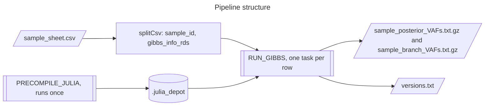

# deep-seq-gibbs: Nextflow pipeline for the phylogenetic VAF Gibbs sampler

A small Nextflow (DSL2) pipeline that runs the phylogenetic VAF Gibbs sampler (`Deep_seq_tree_GS.jl`) once per sample, in parallel, inside a container. It replaces running `../GibbsSampler/wrap_gibbs.jl` by hand for each sample.

**Author:** `medmaca`, derived from the sampler engine and driver by `mspencerchapman`. For how the sampler fits into the wider project, what its inputs contain and how to interpret its output, see the [repository README](../../README.md).

> [!WARNING]
> **Check the input depth convention before relying on results**
> The driver treats the `depth` column as reference reads, but the inputs in this repository hold total depth, so variant reads are counted twice in the likelihood. See K1 in the [repository README](../../README.md#known-issues-and-caveats). The pipeline reproduces the original behaviour exactly until that is resolved.

## What it does

For each row of a sample sheet the pipeline runs the Metropolis-within-Gibbs sampler on one `<sample>_gibbs_info.RDS` file and publishes two gzipped files: posterior VAF draws for every mutation, and posterior top and bottom VAF draws for every branch.



`PRECOMPILE_JULIA` has no inputs, so Nextflow emits its output as a value that is passed to every `RUN_GIBBS` task rather than consumed once. The Julia package cache is therefore compiled a single time per run. Each `RUN_GIBBS` task puts a private writable depot first on `JULIA_DEPOT_PATH`, then the shared precompiled depot, then the depot baked into the image.

## Layout

```text
GibbsSampler_nf/
├── main.nf                          workflow: read the sample sheet, precompile, one RUN_GIBBS per row
├── nextflow.config                  parameters, Apptainer settings, profiles, reports, check_max()
├── conf/base.config                 retry strategy and resources for the process_gibbs label
├── modules/local/precompile_julia.nf  PRECOMPILE_JULIA process
├── modules/local/run_gibbs.nf       RUN_GIBBS process
├── bin/run_gibbs.jl                 command-line driver (parameterised wrap_gibbs.jl)
├── src/Deep_seq_tree_GS.jl          sampler engine with the patches described below
├── env/install.jl                   installs and precompiles the Julia packages during the image build
├── Docker/Dockerfile                image definition
├── Docker/build.log                 log of the image build
├── assets/sample_sheet.csv          example sample sheet (placeholder paths)
├── test/engine_baseline.jl          unpatched engine, used only by the regression test
└── test/regression_check.sh         compares patched and unpatched engine output
```

## Container

The image `docker://mcare/deep-seq-gibbs:0.1.0` is built from `Docker/Dockerfile` and is published on Docker Hub. It contains:

- R 4.5.3 (from `rocker/r-ver`) with `ape`, needed to read the RDS inputs through `RCall`.
- Julia 1.11.3. Julia 1.12 is avoided because `RCall`'s REPL integration does not work with it; `RCALL_REPL_INIT=false` is also set.
- `ArgParse`, `Phylo`, `RCall`, `DataFrames`, `Distributions` and `CodecZlib`, installed and precompiled into `/opt/julia_depot`.
- The driver and engine under `/opt/deep_seq_gibbs`.

Package versions are resolved when the image is built, not pinned. To make a rebuild reproducible, copy `/opt/deep_seq_gibbs/Manifest.toml` out of the current image and commit it.

Build and push (only needed if the engine, driver or dependencies change; bump the tag):

```bash
cd targeted/GibbsSampler_nf
docker build -f Docker/Dockerfile -t mcare/deep-seq-gibbs:<tag> .
docker push mcare/deep-seq-gibbs:<tag>
```

Then set `params.container` to the new tag.

## Sample sheet

A CSV with a header and two columns. Paths should be absolute. Both columns must be non-empty and every file must exist, or the run stops before any work starts.

```text
sample_id,gibbs_info_rds
MD7816c,/path/to/external_mouse_phylo/targeted/GibbsSampler/data/MD7816c_gibbs_info.RDS
MD7816_Bcell,/path/to/pooled_gibbs_inputs/MD7816_Bcell_gibbs_info.RDS
```

`sample_id` becomes the output file stem and the output subfolder name. Pooled inputs made with `mcare_scripts/pooling/pool_gibbs_info.R` are used exactly like single samples. Do not include `MD7634_Liver`, `MD7635_ILC2` or `MD7635_ILC3`: those inputs contain no reads (K2 in the repository README).

To list every per-sample input:

```bash
cd <work_root>/external_mouse_phylo/targeted/GibbsSampler/data
{
  echo "sample_id,gibbs_info_rds"
  for f in "$PWD"/MD781*_gibbs_info.RDS; do
    echo "$(basename "$f" _gibbs_info.RDS),$f"
  done
} > <scratch>/sample_sheet.csv
```

## Running

Launch from a scratch directory: Nextflow writes its `work/` directory and `.nextflow` files where it is launched.

Locally (uses Apptainer, which is enabled in `nextflow.config`):

```bash
nextflow run <work_root>/external_mouse_phylo/targeted/GibbsSampler_nf/main.nf \
    -profile standard \
    --sample_sheet <scratch>/sample_sheet.csv \
    --outdir results
```

On a SLURM cluster:

```bash
nextflow run <work_root>/external_mouse_phylo/targeted/GibbsSampler_nf/main.nf \
    -profile viking2 \
    --sample_sheet <scratch>/sample_sheet.csv \
    --outdir results \
    --hpc_account <your_slurm_account> \
    -resume
```

The `viking2` profile sets the SLURM executor, a queue size of 200, a submission rate of 10 per second and `--account=<hpc_account>`. Add a profile of your own for another scheduler. Run inside `screen` or `tmux`, or submit the Nextflow head job to the scheduler, so it survives logging out.

For a quick test, shorten the chain, for example `--iter 2000 --burn_in 1000 --thin 100`.

## Parameters

All sampler settings are parameters and can be overridden on the command line (for example `--scale_pm 100`) or in a `-c` config file.

| Parameter | Default | Meaning |
| --- | --- | --- |
| `sample_sheet` | none (required) | CSV of samples to process |
| `outdir` | `results` | output directory |
| `container` | `docker://mcare/deep-seq-gibbs:0.1.0` | image that Apptainer pulls and converts |
| `iter` | `20000` | total MCMC iterations |
| `burn_in` | `10000` | iterations discarded before recording |
| `thin` | `100` | record one in every `thin` iterations; the defaults keep 100 draws |
| `scale_pm` | `50` | concentration of the Block 1 Beta proposal (larger means smaller steps) |
| `min_vaf` | `1e-10` | VAF floor and the epsilon used in the constraints |
| `seed` | `42` | random seed (the upstream driver used 28) |
| `ctrl_cov_threshold` | `20` | if `mtr_other + depth_other` is below this, the flat error rate is used |
| `flat_error` | `0.01` | fallback sequencing error rate |
| `max_memory` | `16.GB` | ceiling applied by `check_max()` |
| `max_cpus` | `4` | ceiling applied by `check_max()` |
| `max_time` | `24.h` | ceiling applied by `check_max()` |
| `max_retries` | `3` | retries under the `retry` error strategy |
| `hpc_account` | set to one user's account | SLURM account used by the `viking2` profile; set your own |

Each task requests 1 CPU (the sampler is single-threaded), 4 GB of memory and 4 hours, and memory and time are multiplied by the attempt number on each retry, up to the ceilings.

## Outputs

For each sample, under `<outdir>/iter_<iter>_burnin_<burn_in>_thin_<thin>/<sample_id>/`:

| File | Contents |
| --- | --- |
| `<sample_id>_posterior_VAFs.txt.gz` | tab-separated `Node_assignment`, `mutation_ID`, `Posterior_VAFs` (comma-separated draws), one row per mutation |
| `<sample_id>_branch_VAFs.txt.gz` | tab-separated `Node_assignment`, `Type` (`Top_VAF` or `Bottom_VAF`), `Posterior_VAFs`, two rows per branch |

`Node_assignment` uses `ape` node numbering, so it matches the `node` column of the input. Each branch list begins with the initialisation value (0.5 for branches leaving the root, otherwise 0.0) and so holds one more value than the mutation lists; drop the first value when parsing. Multiply VAFs by 2 to get cell fractions for autosomal mutations; for X and Y mutations in these male mice the cell fraction equals the VAF.

Run reports (`timeline.html`, `report.html`, `trace.txt`, `dag.html`) are written to `<outdir>/pipeline_info/`. `versions.txt` in each task folder records the Julia version.

## Running one sample without Nextflow

```bash
docker run --rm -v <data_dir>:/in:ro -v <out_dir>:/out mcare/deep-seq-gibbs:0.1.0 \
    julia --project=/opt/deep_seq_gibbs /opt/deep_seq_gibbs/bin/run_gibbs.jl \
    --input /in/MD7816c_gibbs_info.RDS --sample-id MD7816c --outdir /out
```

With Apptainer, use `apptainer exec docker://mcare/deep-seq-gibbs:0.1.0 julia ...` with `--bind` in place of `-v`. The container's depot is read-only, so if Julia needs to write to its package cache, put a writable folder first, for example `export APPTAINERENV_JULIA_DEPOT_PATH=$PWD/julia_depot:/opt/julia_depot`.

`run_gibbs.jl` takes `--input`, `--sample-id`, `--outdir`, `--engine` (defaults to `../src/Deep_seq_tree_GS.jl` relative to the script), `--iter`, `--burn-in`, `--thin`, `--scale-pm`, `--min-vaf`, `--seed`, `--ctrl-cov-threshold` and `--flat-error`. Run it with `--help` for details.

## Differences from the original sampler

The engine in `src/` differs from `../GibbsSampler/src/Deep_seq_tree_GS.jl` in three ways, all inside `deep_seq_GS`:

1. **Block 2 crash guard.** When the slack at a node is zero or rounds slightly below zero, the original code calls `Uniform(0, x)` with `x <= 0`, which throws. The patched code pins the windows to the current mutation extremes in that case, without drawing random numbers. When the slack is positive, which is the normal case, behaviour is identical.
2. **Traversal orders computed once.** The node and branch traversal orders are computed before the iteration loop instead of on every iteration. They are deterministic, so results are unchanged.
3. **Proposal distribution reused.** The Block 1 proposal distribution is built once per update and reused for its log-density. The random draws and every computed value are unchanged.

The `BranchT` change (using the concrete branch type of the loaded tree instead of `LinkBranch`, needed for current `Phylo.jl`) is kept from the fork's version of the original driver and engine.

## Regression test

`test/regression_check.sh` runs `bin/run_gibbs.jl` twice on the same input with the same seed and settings, once with the patched engine and once with `test/engine_baseline.jl` (the unpatched engine), and compares the decompressed outputs.

```bash
test/regression_check.sh /path/to/<sample>_gibbs_info.RDS [sample_id]
```

It needs Julia with the packages listed above and R with `ape` in the environment it runs in, for example inside the container. A `PASS` means the patches did not change the output on that input.

## Notes

- The image has been built (see `Docker/build.log`) and runs: a 300-iteration run on a pooled input completed and wrote both output files on 18 September 2026.
- Comments in `main.nf` and `modules/local/precompile_julia.nf` mention `.first()` and `storeDir`. Neither is used, and neither is needed.
- The known issues that affect the sampler (K1, K2, K17, K18, K20) are described in the [repository README](../../README.md#known-issues-and-caveats).
</content>
</invoke>
